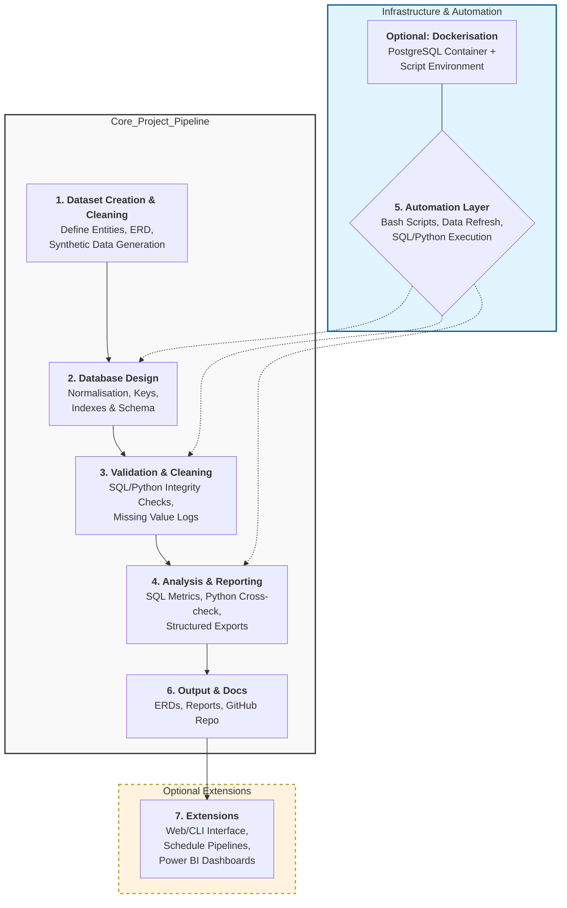

```mermaid
graph TD
	%% Main Workflow Steps:
	subgraph Core_Project_Pipeline
		A[<b>1. Dataset Creation & Cleaning</b><br/>Define Entities, ERD,<br/>Synthetic Data Generation] --> B[<b>2. Database Design</b><br/>Normalisation, Keys,<br/>Indexes & Schema]
		B --> C[<b>3. Validation & Cleaning</b><br/>SQL/Python Integrity Checks,<br/>Missing Value Logs]
		C --> D[<b>4. Analysis & Reporting</b><br/>SQL Metrics, Python Cross-check,<br/>Structured Exports]
		D --> F[<b>6. Output & Docs</b><br/>ERDs, Reports, GitHub Repo]
	end

	%% Automation Integration
	subgraph Automation_Infrastructure [Infrastructure & Automation]
		E{<b>5. Automation Layer</b><br/>Bash Scripts, Data Refresh,<br/>SQL/Python Execution}
		G[<b>Optional: Dockerisation</b><br/>PostgreSQL Container +<br/>Script Environment]
	end

	%% Optional Extensions
	subgraph Future_Extensions [Optional Extensions]
		H[<b>7. Extensions</b><br/>Web/CLI Interface,<br/>Schedule Pipelines,<br/>Power BI Dashboards]
	end

	%% Connections to Automation and Extensions:
	E -.-> B
	E -.-> C
	E -.-> D
	G --- E
	F --> H

	%% Styling:
	style Core_Project_Pipeline fill:#f9f9f9,stroke:#333,stroke-width:2px
	style Automation_Infrastructure fill:#e1f5fe,stroke:#01579b,stroke-width:2px
	style Future_Extensions fill:#fff3e0,stroke:ef6c00,stroke-width:2px,stroke-dasharray: 5 5

```
